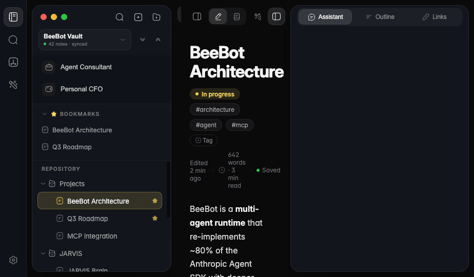
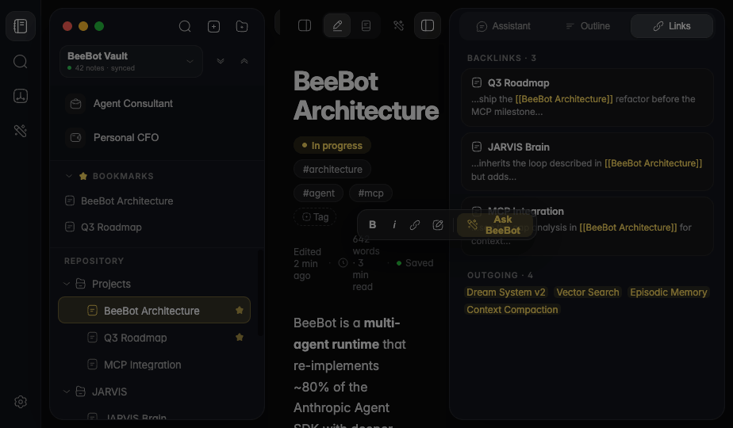

# Handoff: Note App — Improved (Apple-style Knowledge Workspace)

## Overview
This is a UI/UX redesign of the **BeeBot Knowledge Workspace** (the note-taking app) —
an Obsidian/Notion-style workspace with a left ribbon, a floating glass sidebar (repository
tree + bookmarks + app nav), a Safari-style tabbed editor, and a **unified floating right
panel** (Assistant · Outline · Links). The direction is **Apple (macOS / iPadOS)
minimalist-futuristic**: flat dark base, hairline borders, generous rounded radii, glass
surfaces, tight Inter tracking.

This handoff describes exactly how to fold the redesign into the **existing** codebase
(`cute-ai-agent`, Vite + React + shadcn-ui + Tailwind), file by file, **without touching the
wiring** (event handlers, hooks, state, data fetching).

## Screenshots
Reference renders of the design (in `screenshots/`). These are captured with the glass
panels flattened to a solid fill for legibility — in the real app the sidebar and right
panel use `backdrop-filter` glass over the flat `#0a0a0b` base.



*Full workspace: 52px ribbon · floating glass sidebar (vault chip → bookmarks → repository tree → app nav) · Safari-style tabs + chrome cluster · editor with note title / status pill / tags / meta line · unified right panel with the Assistant · Outline · Links segmented control.*



*Right panel on the **Links** tab: "Backlinks · 3" cards (source note + context snippet with the wikilink highlighted) and "Outgoing · 4" wikilink chips. The floating text-selection toolbar (B / i / link / highlight / **Ask BeeBot**) is also visible over the editor.*

> The **Spotlight search modal** (⌘K), **Assistant chat** with the full composer toolbar,
> **Outline** tab, hover/active states, and the tab close-on-hover circle are all
> interactive — open `Note App — Improved.dc.html` in a browser to see them live.

---

## About the Design Files
`Note App — Improved.dc.html` in this bundle is a **design reference created in HTML** — a
prototype showing the intended look and behavior. **It is not production code to copy
directly.** It is not React; it will not compile into the app.

Your task is to **recreate this design inside the existing React components** listed below,
using the codebase's established patterns (shadcn-ui, Tailwind, the `--bb-*` / `--glass-*`
tokens in `src/index.css`). Change **markup and styling only** — preserve every prop,
handler, hook, and piece of state exactly as it is today.

Because this mock was built directly from the current component structure, the mapping is
1:1. Nothing here requires new architecture.

## Fidelity
**High-fidelity (hifi).** Final colors, typography, spacing, radii, and interaction states
are specified below and should be reproduced precisely. Where a value is expressed as a
Tailwind/token equivalent, prefer the existing token.

---

## Target files in the codebase (the 1:1 map)

| Design region | File to edit | Nature of change |
|---|---|---|
| Overall 4-pane layout, right-panel unification | `src/pages/KnowledgeWorkspacePage.tsx` | Layout + which panels render |
| Left ribbon (52px rail) | `src/pages/KnowledgeWorkspacePage.tsx` (ribbon markup) | Style only |
| Floating glass sidebar | `src/features/notes/sidebar/SidebarHeader.tsx` | Markup + style |
| Vault → workspace-switcher chip | `src/features/notes/sidebar/SidebarHeader.tsx` | Markup + style |
| Repository tree rows | `src/features/notes/sidebar/NoteTree.tsx` | Style only (keep handlers) |
| Bookmarks section | `src/features/notes/sidebar/BookmarksSection.tsx` | Style only |
| App nav (Consultant / CFO) | `src/features/notes/sidebar/AppNav.tsx` | Style only |
| Safari-style tab strip | `src/features/notes/tabs/TabStrip.tsx` | Style only (keep close/reorder) |
| Chrome cluster (edit/read/panel toggles) | `src/features/notes/chrome/ChromeCluster.tsx` | Style + group into segmented control |
| **Remove** breadcrumb bar; add note meta line | `src/features/notes/breadcrumb/BreadcrumbBar.tsx` + editor header | Hide in UI (keep nav logic) |
| Unified right panel (Assistant/Outline/Links) | `src/features/notes/backlinks/BacklinksPane.tsx` + BeeBot chat view | Merge under a segmented control |
| Design tokens | `src/index.css` | Add/adjust radii, borders, base bg |

---

## Screens / Views

### 1. Left Ribbon (fixed 52px rail)
- **Purpose**: top-level app switcher (Notes / Search / Graph / Skills) + Settings at bottom.
- **Layout**: `width: 52px`, full height, glass surface, `border-right: 0.5px solid rgba(255,255,255,0.07)`. Flex column, `justify-content: space-between`, `padding: 14px 0`, `align-items: center`.
- **Buttons**: `38×38px`, `border-radius: 12px`. Active item = `background: rgba(255,255,255,0.10)` + `inset 0 0 0 0.5px rgba(255,255,255,0.12)`, icon color `#f2f2f2`. Inactive icon `#9b9b9d`; hover `background: #1a1a1c`, icon `#ededed`.
- **Icons** (Solar linear): notebook, magnifer, branching-paths-down, magic-stick-3, settings.

### 2. Floating Glass Sidebar (272px)
- **Purpose**: repository tree, bookmarks, app nav.
- **Layout**: `width: 272px`, `margin: 10px 0 10px 10px` (floats off all edges), `border-radius: 18px`, `overflow: hidden`, `border: 0.5px solid rgba(255,255,255,0.08)`, glass fill, `box-shadow: 0 18px 50px -16px rgba(0,0,0,0.6)`. Flex column.
- **Header rows** (`padding: 0 12px 10px`):
  - **Traffic-light row** (`height: 44px`): three 12px dots (`#ff5f57`, `#febc2e`, `#28c840`), then right-aligned icon buttons `34×34`, `radius: 11px`: **search (opens modal — NOT an inline input)**, new-note, new-folder. Hover `rgba(255,255,255,0.07)`.
  - **Vault switcher chip** (see §2a).
  - Expand-all / collapse-all: `28×28`, `radius: 8px`.
- **Bookmarks** (`§ BookmarksSection`): uppercase 10.5px label (`letter-spacing: 0.09em`, color `#7a7a7c`) with a gold star; rows `height: 32px`, `radius: 9px`, font 12.5px, color `#9b9b9d`. Bottom `border-bottom: 0.5px solid rgba(255,255,255,0.05)`.
- **Repository tree**: see §3.
- **App nav** (`§ AppNav`): top `border-top: 0.5px solid rgba(255,255,255,0.06)`, two rows (Agent Consultant, Personal CFO). Each: icon tile `26×26`, `radius: 8px`, `background: #1a1a1c`; label 13px `#c4c4c6`; row `radius: 10px`, hover `#1a1a1c`.

### 2a. Vault → Workspace-switcher chip  ⭐ (redesigned)
- **Container**: `flex: 1`, `border: 0.5px solid rgba(255,255,255,0.07)`, `background: rgba(255,255,255,0.03)`, `border-radius: 11px`, `padding: 6px 9px`, `gap: 8px`. Hover: `background: rgba(255,255,255,0.06)`, `border-color: rgba(255,255,255,0.12)`.
- **Text** (no avatar/logo — kept text-only and minimal): line 1 = vault name `12.5px / 640 / #e8e8ea`; line 2 = `9.5px #7a7a7c` with a `5px` green dot (`#34c759`) + "N notes · synced".
- **Chevron**: alt-arrow-down, `#6a6a6c` → `#c4c4c6` on hover.

### 3. Repository Tree (`NoteTree.tsx`)
- Section label "Repository" (uppercase 10.5px, `#7a7a7c`).
- **Row**: `height: 34px`, `border-radius: 9px`, font 13px, color `#9b9b9d`, `letter-spacing: -0.01em`, `transition: background .13s`.
  - Indent = `depth * 15 + 4` px spacer.
  - Chevron (folders): `14px` box, rotates `0 → 90deg` on expand (`transition: transform .18s`).
  - Icon: Solar folder / folder-open / document, `15px`. Active note icon = accent.
  - Trailing: folder note-count `11px #5a5a5c` (only when collapsed); starred notes show a gold star (`opacity 0.85`).
  - **Hover** (non-active): `background: #1a1a1c`, color `#ededed`.
  - **Active**: `background: color-mix(in oklab, var(--accent) 15%, transparent)`, color `#f2f2f2`, `inset 0 0 0 1px color-mix(in oklab, var(--accent) 30%, transparent)`.
- **Keep** all existing behavior: select, expand/collapse, drag-reorder, context menu.

### 4. Editor Header — Safari-style Tabs + Chrome Cluster
- **Header height**: `44px`, `padding: 0 6px`, top-aligned with sidebar/panel (all start at `10px` from top).
- **Tab** (`TabStrip.tsx`): `height: 34px`, `min-width: 132px`, `max-width: 220px`, `border-radius: 12px`, `gap: 6px`, `padding: 0 10px`, font 12.5px.
  - Inactive color `#9b9b9d`; hover `background: rgba(255,255,255,0.045)`.
  - **Active**: `background: rgba(255,255,255,0.09)`, `#f2f2f2`, `box-shadow: 0 1px 3px rgba(0,0,0,0.35), inset 0 0 0 0.5px rgba(255,255,255,0.10)`.
  - File icon = accent when active, else `#7a7a7c`.
  - **Close button** ⭐: `18×18`, **`border-radius: 50%`**, hidden until tab hover (`opacity 0 → .75`). **On hover of the button itself**: `background: rgba(255,255,255,0.14)`, color `#f2f2f2`, `opacity 1`. `transition: opacity .14s, background .14s, color .14s`.
  - "New tab" `+`: `34×34`, `radius: 12px`.
- **Chrome cluster** (`ChromeCluster.tsx`), right side, `gap: 3px`:
  - Sidebar toggle `34×34`, `radius: 11px`.
  - **Edit/Read segmented control**: wrapper `background: rgba(255,255,255,0.05)`, `radius: 11px`, `padding: 2px`; each segment `30×34`, `radius: 9px`; active segment `background: rgba(255,255,255,0.11)` + hairline inset. Icons: pen-2 / book.
  - Skills button; right-panel toggle (active state like ribbon).
  - Right-panel toggle icon = sidebar-minimalistic mirrored (`transform: scaleX(-1)`).

### 5. Editor Surface
- **No breadcrumb / back-forward bar.** (Nav history logic stays in code; just don't render the bar.)
- Content column: `max-width: 740px`, centered, `padding: 30px 32px 96px`. Base bg **flat `#0a0a0b`** (no mesh gradient).
- **Note title**: `33px / 720 / -0.028em`, color `#f4f4f4`, `line-height: 1.12`.
- **Property row**: status pill (accent 13% bg, accent text, 6px dot, `999px`), tags (`#161618` bg, `0.5px #262628` border, `#9b9b9d`, `999px`), and an add-tag chip (dashed border). All `padding: 4px 11px`, `12px`.
- **Meta line** (replaces breadcrumb): `12px #6a6a6c` — "Edited 2 min ago · [clock] 642 words · 3 min read · [green dot] Saved".
- **Prose**: 16px / `line-height 1.68` / `-0.003em`; h2 `1.4em / 680`; code `#1c1c1e` bg + `#e6c07b`; pre `#161618` + `0.5px` border + `14px` radius; wikilinks accent with `color-mix 11%` bg; callout with 3px accent left border + `14px` radius.
- **Selection toolbar** (floats over selected text): glass pill `rgba(30,30,32,0.82)` + `blur(24px)`, `radius: 13px`, `padding: 4px`; B / i / link / highlight buttons (`30px`, `radius: 9px`); divider; **"Ask BeeBot"** accent button.

### 6. Unified Floating Right Panel (348px)  ⭐ (merged)
- **Container**: `width: 348px`, `margin: 10px 10px 10px 0`, `border-radius: 18px`, glass, `border: 0.5px solid rgba(255,255,255,0.08)`, `box-shadow: 0 18px 50px -16px rgba(0,0,0,0.6)`. **Floating card like the sidebar** (no flat `border-left`).
- **Segmented control** header (`height: 44px`, `padding: 7px 12px`): wrapper `rgba(255,255,255,0.045)`, `radius: 12px`, `padding: 3px`; three segments **Assistant · Outline · Links**, each `radius: 10px`, font 12px, active `background: rgba(255,255,255,0.11)` + hairline inset. Icons: chat-round-line / list / link.
- **Assistant tab**: context chip ("Context: <note>"), user bubble (accent 13% bg, `18px 18px 6px 18px`), assistant bubble (`#161618`, `6px 18px 18px 18px`) with inline task checklist + action pills ("Create tasks", "Insert in note"). Composer: quick-action chips row (Summarize / Find related / Improve writing) + input card with the **full control toolbar** (see §7).
- **Outline tab**: "On this page" H2/H3 list; active item accent left-border + `#161618` bg.
- **Links tab**: "Backlinks · N" cards (`#161618`, `0.5px` border, `13px` radius, wikilink snippet) + "Outgoing · N" wikilink chips.
- **Reuse existing data**: BeeBot chat view for Assistant, `BacklinksPane` data for Links, note-heading parser for Outline.

### 7. Assistant Composer controls (mirror `src/components/agent-chat/ChatInput.tsx`)
- Input card: `background: rgba(22,22,24,0.7)` + `blur(20px)`, `border: 0.5px solid rgba(255,255,255,0.10)`, `border-radius: 22px`, `padding: 12px 14px 9px`.
- **Bottom toolbar** — left group: attach `+` · connectors (globe) · **model selector** ("Claude Sonnet 4.5" with brain/cpu-bolt icon + chevron). Right group: mic · **send** (`34×34`, `border-radius: 50%`, accent bg, dark glyph).
- All buttons `34×34`, `radius: 11px`, `#9b9b9d`, hover `#1a1a1c`.

### 8. Spotlight Search Modal (opened by the sidebar/ribbon search icon)
- **Overlay**: `rgba(0,0,0,0.5)` + `blur(6px)`; panel top-offset `14vh`, entry animation (fade + `translateY(-8px) scale(.98)` over `.2s`).
- **Panel**: `width: 600px`, `background: rgba(28,28,30,0.86)` + `blur(40px) saturate(180%)`, `border: 0.5px solid rgba(255,255,255,0.14)`, `border-radius: 20px`, `box-shadow: 0 40px 100px -20px rgba(0,0,0,0.7)`.
- Search field row (18px placeholder, `ESC` kbd hint) + result rows (`32px` icon tile, title `#f2f2f2`, path `#7a7a7c`, `radius: 12px`, hover `#202022`).
- **Wire to the codebase's existing command/search modal** — this replaces the removed inline search field. `⌘K` / `Ctrl+K` toggles; `Esc` closes.

---

## Interactions & Behavior
- **Ribbon / tabs / segmented controls**: active state via class toggle (not inline style swap) so highlights diff reliably.
- **Tree**: click note → open/activate; click folder → expand/collapse (chevron rotates). Preserve drag-reorder + context menu.
- **Tabs**: click → activate; hover → reveal close; click close → close tab. Preserve reorder.
- **Right panel**: segmented control switches Assistant/Outline/Links; toggle button in chrome shows/hides the whole panel. Content fades in (`.18s`).
- **Search modal**: `⌘K` toggle, `Esc` close, click-outside closes.
- **Selection toolbar**: appears on text selection in the editor (existing editor selection logic).
- **Transitions**: backgrounds/colors `.13–.15s`; chevron `.18s`; panel fade `.18s`; modal `.2s` cubic-bezier(.2,.9,.3,1).

## State Management
No new global state. Local UI state mirrors what the components already own:
- `activeNotePath` / open-tabs array (existing).
- `mode`: `"edit" | "preview"` (existing edit/read toggle).
- `railOpen: boolean` + `railTab: "assistant" | "outline" | "links"` — **new**: replaces the two separate "backlinks open" / "agent open" booleans. Migrate those two flags into one `railOpen` + a `railTab` selector.
- `searchOpen: boolean` — bind to the existing command/search modal instead of a local flag if one exists.
- Expanded-folders map, bookmarks, backlinks data, chat thread — all existing hooks/queries unchanged.

## Design Tokens
Add/confirm these in `src/index.css` (names already present are marked):

- **Base app bg**: `#0a0a0b` (flat — remove the mesh radial-gradient overlay).
- **Glass surface**: `rgba(20,22,28,0.6)`, `backdrop-filter: blur(32px) saturate(170%)`. (existing `--glass-*` scale.)
- **Hairline border**: `0.5px solid rgba(255,255,255,0.07)` (rest) → `0.10` (emphasis).
- **Accent**: `--beebot-accent` / mock `--ac` default `#f4d35e` (runtime-themeable). Alt swatches used in mock: `#7AA2FF`, `#5BD6A0`, `#C792EA`.
- **Radii**: card/panel `18px`; input/composer `22px`; control `11px`; segment `9–10px`; tree row / tab `9–12px`; pill `999px`. (existing `--glass-radius-*`: container 24px, card 20px, control 12px — align mock 18/11 to these or add `--radius-panel: 18px`.)
- **Neutrals** (mock literals; map to existing `--bb-bg-*` / `--bb-text-*` OKLCH scale):
  - Surfaces: `#0a0a0b` base · `#161618` card-inset · `#1a1a1c` hover · `#1c1c1e` raised · `#202022` strong-hover.
  - Text: `#f4f4f4` title · `#f2f2f2` active · `#ededed` primary · `#d4d4d4` body · `#c4c4c6` secondary · `#9b9b9d` muted · `#7a7a7c` faint · `#5a5a5c` disabled.
  - Status: green `#34c759` / `#28c840`.
- **Type**: Inter Variable, `font-feature-settings: 'cv11','ss01','cv01'`, base tracking `-0.006em`, `-webkit-font-smoothing: antialiased`.
- **Shadows**: floating card `0 18px 50px -16px rgba(0,0,0,0.6)`; toolbar `0 14px 40px rgba(0,0,0,0.55)`; modal `0 40px 100px -20px rgba(0,0,0,0.7)`.

## Assets — Icons ⭐
The mock uses **Solar** icons (via Iconify CDN) — identical artwork to the npm package the
user wants:
```bash
npm install @solar-icons/react
```
```tsx
import { Magnifer, Notebook, Wallet, MagicStick3, AltArrowDown, Document, Pen2, Book } from "@solar-icons/react";
<Magnifer size={16} weight="Linear" />
```
Icon name map (all **Linear** weight unless noted):
- Ribbon: `Notebook`, `Magnifer`, `BranchingPathsDown`, `MagicStick3`, `Settings`
- Sidebar: `Magnifer`, `AddSquare` (new note), `AddFolder`, `FolderOpen`, `AltArrowDown`, `DoubleAltArrowDown`/`Up` (expand/collapse), `Star` (Bold), `Document`, `CaseMinimalistic`, `Wallet`
- Chrome: `SidebarMinimalistic` (+ mirrored for right), `Pen2`, `Book`, `MagicStick3`
- Panel/composer: `ChatRoundLine`, `List`, `Link`, `CpuBolt` (model), `Global` (connectors), `Microphone`, `Plain2` (send), `ClockCircle`, `PenNewSquare` (highlight), `CheckRead`, `CloseSquare`, `AltArrowRight`

## Files (in this bundle)
- `Note App — Improved.dc.html` — the hifi design reference (open in a browser to inspect exact pixels, hover states, and the search modal / segmented panel interactions).
- `screenshots/01-main.png` — full-workspace layout reference.
- `screenshots/03-links-panel.png` — right panel (Links tab) + selection toolbar.

## Implementation order (safest → most impactful)
1. Tokens in `index.css` (flat bg, radii, hairlines).
2. `NoteTree.tsx` + `BookmarksSection.tsx` + `AppNav.tsx` — style only.
3. `SidebarHeader.tsx` — vault chip + confirm icon-only search.
4. `TabStrip.tsx` — Safari tabs + circular close-hover.
5. `ChromeCluster.tsx` — segmented edit/read.
6. Remove `<BreadcrumbBar/>` render; add note meta line in the editor header.
7. `KnowledgeWorkspacePage.tsx` — merge the two right panels into one `railOpen` + `railTab` segmented panel; make it a floating card.
8. Composer controls parity with `ChatInput.tsx`.
9. Swap icons to `@solar-icons/react`.
10. `npm run dev` after each step; verify open-note / close-tab / send-message still work.

> **Golden rule:** change markup + className/style only. Never remove or rename a prop,
> handler, hook call, or query. If a redesigned element replaces two old ones (the right
> panel), keep **both** data sources wired and just re-parent them under the new shell.
